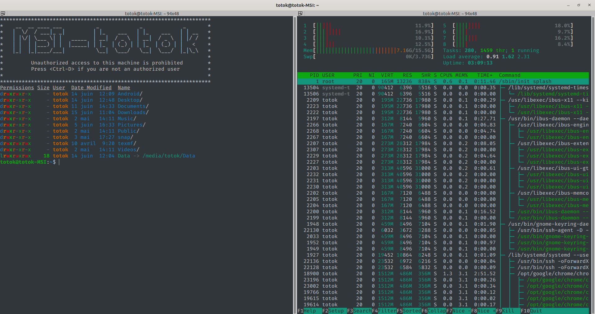
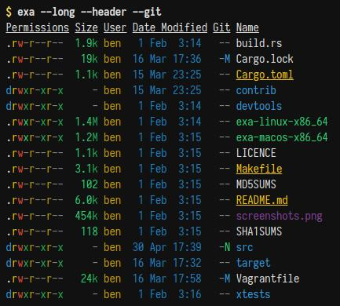
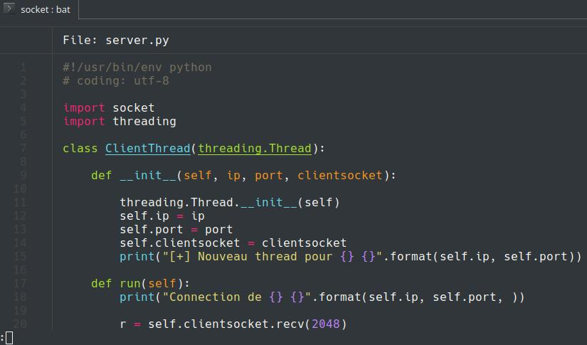

# Paquets linux indispensables

Liste de paquets et logiciels qui simplifient la vie sous linux


## BashRC

BashRC n'est pas un paquet, mais un outil très pratique : C'est un fichier situé dans le répertoire home de chaque user, exécuté à la connexion. Il permet notamment de créer des Alias de commandes.
Pour la plupart des paquets qui suivront je vous mettrai aussi le contenu de mon `.bashrc`, si vous voulez vous simplifier la vie.

Pour modifier le fichier : ouvrez le avec votre éditeur favori : 

```bash
nano ~/.bashrc
```

Modifiez le fichier, enregistrez le, puis pour appliquer les changements sans vous déconnecter, tapez la commande suivante.

```bash
source ~/.bashrc
```


Un exemple d'alias utile : 

`alias up="sudo apt-get update -y && sudo apt-get upgrade -y"`

Cela permet de taper "up" pour faire vos mises à jour.


## Terminator

[Terminator](https://doc.ubuntu-fr.org/terminator) est un émulateur de terminal très customisable, pouvant afficher plusieurs onglets et pouvant être splitté en colonnes et lignes à l'infini.

Pour l'installer, tapez simplement  `sudo apt install terminator`.

Par défaut, le terminal est (très) moche. Voici [ma configuration](./config_terminator), que vous pouvez placer dans `~/.config/terminator/config`.



## Exa

Clone de ls avec une colorisation différente, très pratique pour les permissions.

https://the.exa.website/




> Dans le bashrc

`alias ll='exa -laF --group-directories-first --header --git --long'
alias la='exa -a --group-directories-first'
alias l='exa -lF --group-directories-first --header --git --long'`


## Bat

Permet d'afficher des fichiers dans le terminal avec la colorisation syntaxique

https://github.com/sharkdp/bat



### Utilisation : 

tapez `bat <fichier>` pour afficher le fichier. Utilisez les flèches dirrectionnelles pour vous déplacer, et `q ` pour quitter.


>  Dans le bashRC

`alias less="bat"`


## TL;DR

https://tldr.sh/

Abréviation de "Too long, didn't read", TLDR permet d'avoir des exemples de commandes plutôt que de la doc longue à lire.


## TheFuck

https://github.com/nvbn/thefuck

Vous avez oublié un sudo ou fait une faute de frappe dans une commande ? Tapez thefuck et ça vous trouve la commande adaptée (possibilité d'ajouter un alias dans le .bashrc !)


> Dans le bashRC

`eval $(thefuck --alias)`


## Typora

https://typora.io/

Éditeur de fichiers markdown disponible sous Windows, Mac, Linux.


## Franz

https://meetfranz.com/

Logiciel regroupant tous vos clients de messagerie préférés.

Consomme pas mal de RAM, mais est très pratique. Disponible sous Windows, Mac, Linux.

