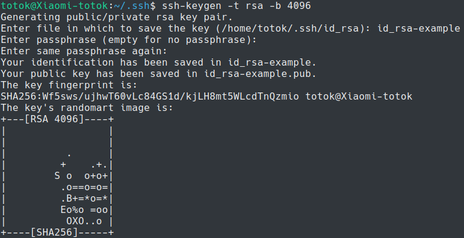
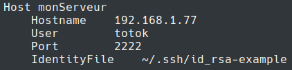

# SSH-keygen pour les nuls

A chaque fois que vous vous connectez à un serveur, vous devez entrer le mot de passe. Si vous avez beaucoup de serveurs, vous devez avoir beaucoup de mots de passe différents (bandes d'inconscients qui n'en avez que un ou deux !)... Si quelqu'un trouve votre mot de passe, il aura accès à votre serveur !

Comment palier à ça ? Utilisez du RSA !


### Principe du chiffrement asymétrique

Je vous laisse bouquiner ça si l'envie vous prend... 

[https://fr.wikipedia.org/wiki/Cryptographie_asymétrique](wikipedia/Cryptographie asymétrique)


## Génération d'une clé

```shell
sudo apt install ssh
```

Vous devez générer un couple de clés de chiffrement. La clé publique sera envoyée au serveur, et vous garderez bien précieusement la clé privée. Lorsque vous vous connecterez en ssh, vous utiliserez cette clé privée pour vous authentifier.


```shell
cd ~/.ssh
ssh-keygen -t rsa -b 4096
```

Choisissez un nom explicite pour la clé, et entrez un mot de passe fort.




## Envoi de la clé au serveur

Ensuite, vous devez envoyer la clé publique au serveur, qui la stockera par défaut à l'emplacement `~/.ssh/authorized_keys`.

```shell
ssh-copy-id -i emplacement/de/la/clé/publique.pub totok@ip-du-serveur
```


Vous pouvez maintenant modifier les paramètres du serveur distant.

```shell
ssh totok@ip-du-serveur
sudo nano /etc/ssh/sshd_config
```

Les lignes suivantes doivent être décommentées et à ces valeurs : 

```
PubkeyAuthentication yes
PasswordAuthentication no
PermitEmptyPasswords no
```

Redémarrez le serveur ssh :

```shell
sudo service ssh restart
```


Il ne vous reste plus qu'à vous connecter avec votre clé !

```shell
ssh -i adresse/de/la/clé/privée totok@ip-du-serveur
```

> Mais, c'est nul ! Je dois encore taper un mot de passe vu que la clé est protégée ! Et en plus je dois spécifier l'adresse de la clé, ça fait une commande plus longue à taper !


## SSH config file

Créez le fichier `~/.ssh/config`. Dans celui ci, vous pouvez ajouter autant de configurations ssh que vous voulez. Voici un exemple de configuration : 



Pour vous connecter au serveur, vous n'aurez plus qu'à taper

```shell
ssh monServeur
```

> Mais totok ? Je dois encore taper un mot de passe ! On a fait tout ça pour rien ?


Non, déjà, quelqu'un qui a le mot de passe de la clé ne pourra pas y accéder sans cette clé ! La seule machine au monde qui peut se connecter au serveur est la votre maintenant ! Pour ajouter d'autres machines, vous devez repasser temporairement le serveur en authentification par mot de passe, et recommencer ce tutoriel !


## SSH agent

Pour éviter d'avoir à taper votre mot de passe à chaque fois, vous pouvez utiliser `ssh-agent` !

```shell
ssh-add emplacement/de/la/clé
```

Tapez le mot de passe pour ajouter la clé à l'agent, et vous n'aurez plus à le faire jusqu'à la prochaine ouverture de session !

